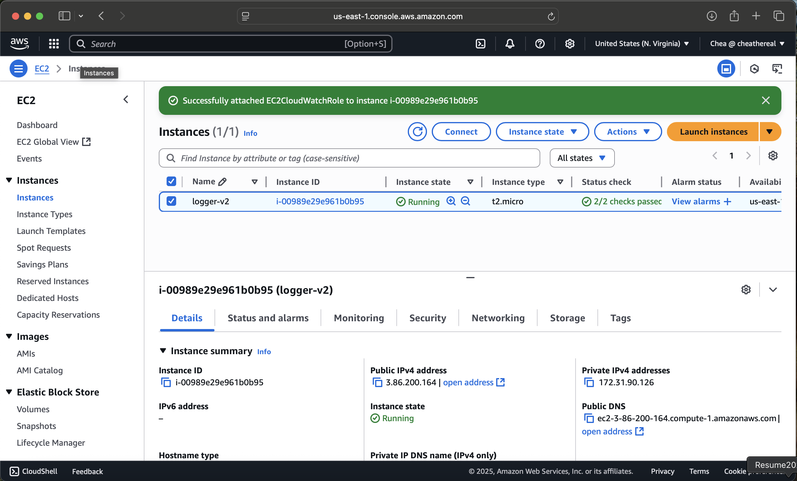
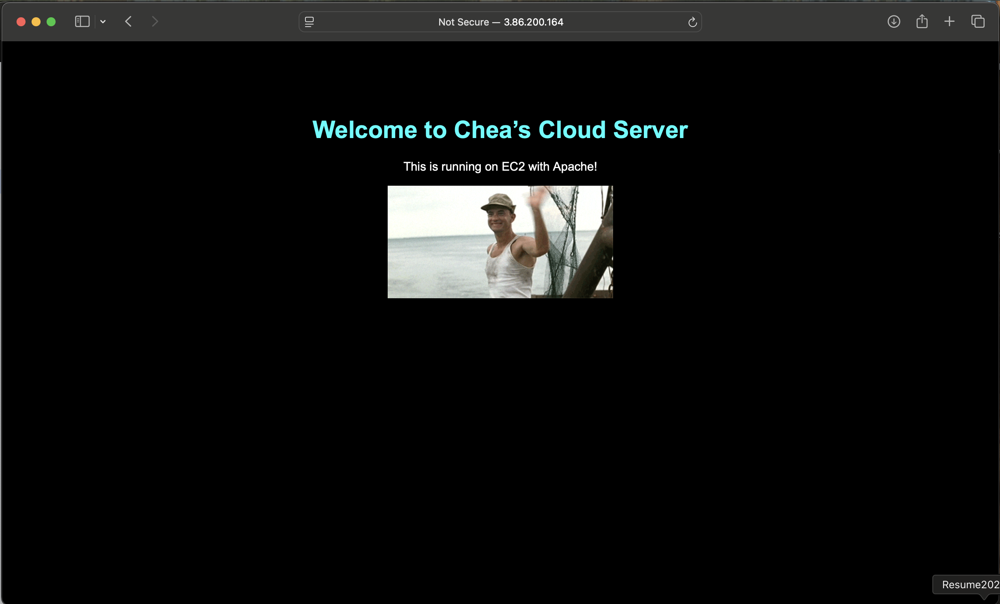
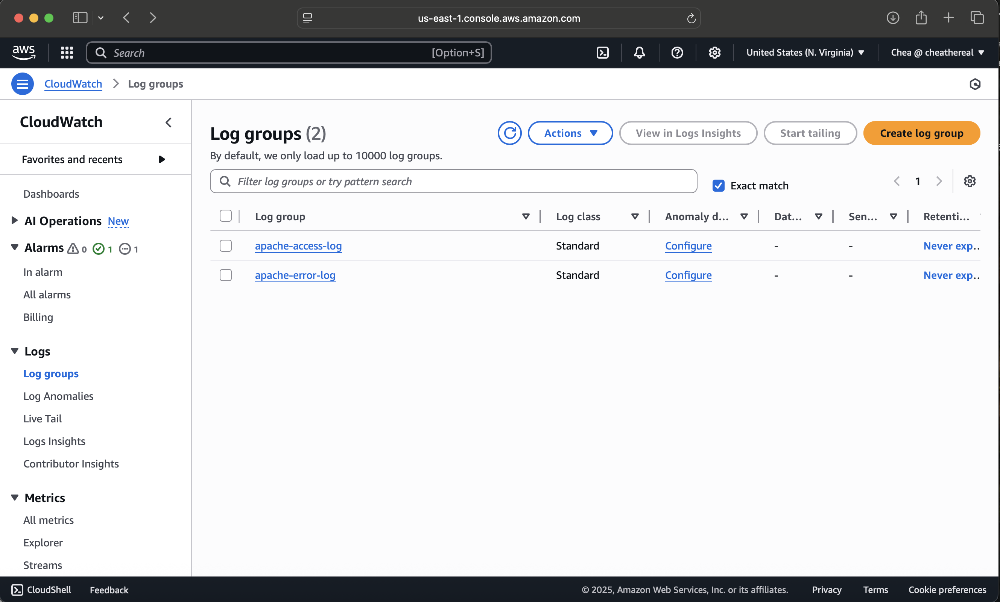
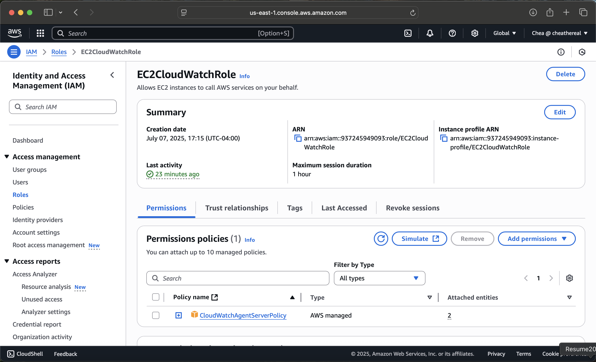

# EC2 CloudWatch Logger (V2)

This project demonstrates how to:
- Launch an EC2 instance
- Install and configure Apache web server
- Set up IAM roles for EC2
- Install and configure CloudWatch Agent
- Stream Apache logs (access and error) to AWS CloudWatch

## AWS Services Used
- EC2
- IAM (Role-based permissions)
- CloudWatch Logs
- CloudWatch Agent

## Skills Demonstrated
- Secure SSH access via .pem file
- Linux package management (yum)
- Terminal navigation and Apache setup
- Log file monitoring
- Role-based access control in AWS

## Screenshots

### EC2 Instance Running

### Apache Web Server Homepage

### CloudWatch Log Group - Access Log/Error Log

### IAM Role Assigned to EC2

## Status
✅ Complete

